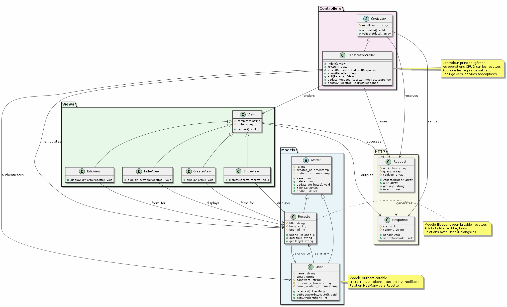
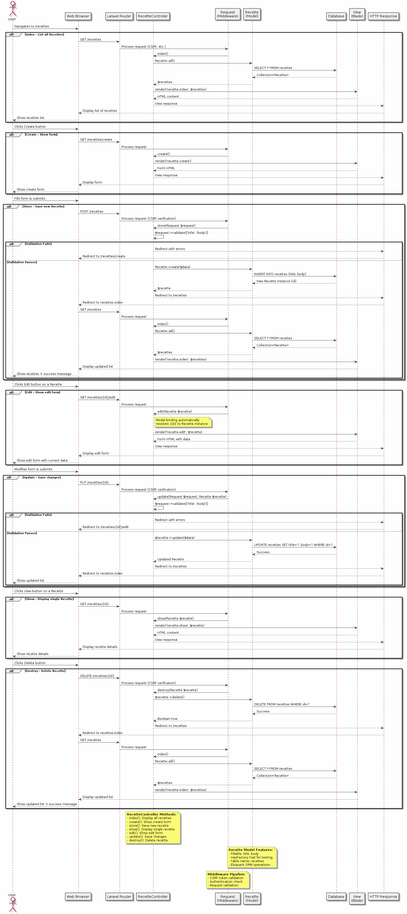
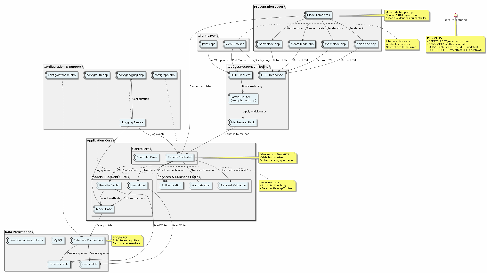
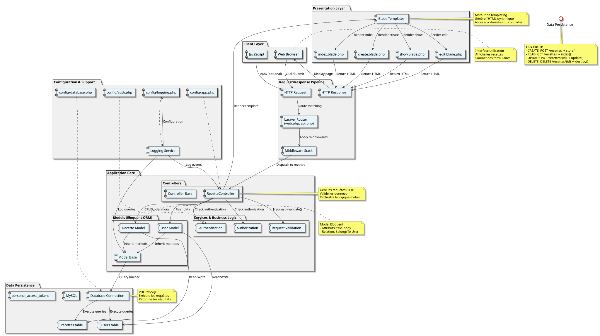
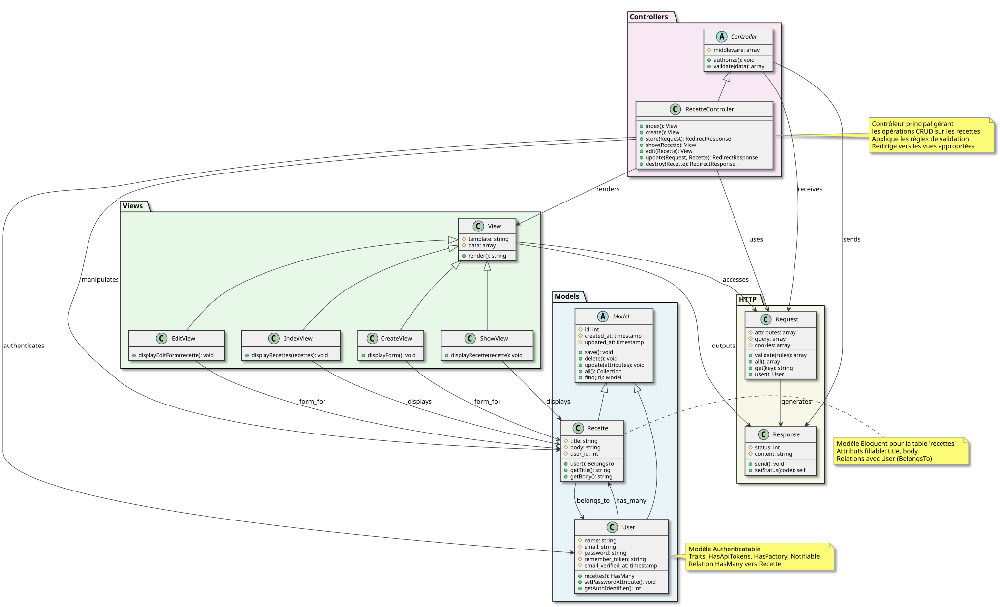
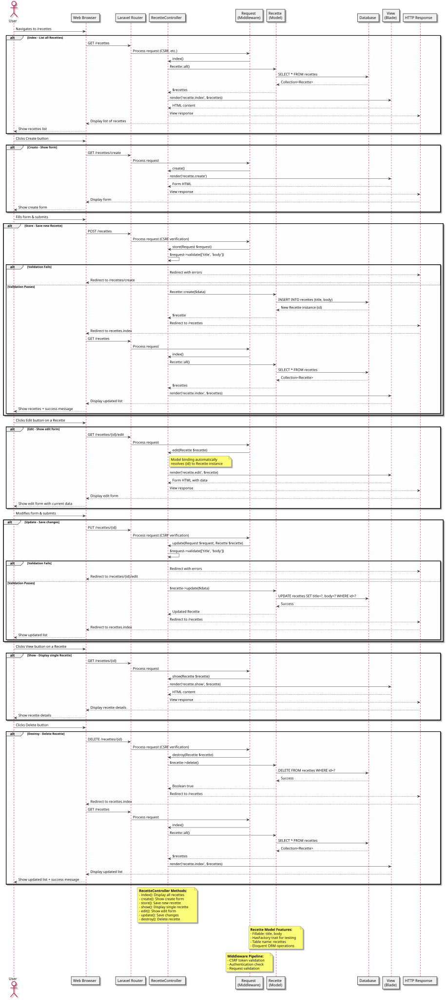

# 🎨 Visualisation des Diagrammes PlantUML

## 📊 Ouvrir les Diagrammes

### Option 1: Visualisation HTML
Ouvrez le fichier `DIAGRAMMES.html` dans votre navigateur pour une vue d'ensemble interactive.

```bash
open DIAGRAMMES.html  # macOS
xdg-open DIAGRAMMES.html  # Linux
start DIAGRAMMES.html  # Windows
```

### Option 2: Visualiser les Images

Les fichiers PNG et SVG générés sont directement visualisables:

**Format PNG** (recommandé pour la documentation):
- `Recettes_Class_Diagram.png` - Diagramme de classes
- `Recettes_Sequence_Diagram.png` - Flux CRUD
- `Recettes_Architecture_Diagram.png` - Architecture
- `Recettes_ER_Diagram.png` - Entité-Relation
- `Recettes_Activity_Diagram.png` - Flux d'activité

**Format SVG** (vectoriel, scalable):
- `Recettes_Class_Diagram.svg`
- `Recettes_Sequence_Diagram.svg`
- `Recettes_Architecture_Diagram.svg`
- `Recettes_ER_Diagram.svg`
- `Recettes_Activity_Diagram.svg`

### Option 3: Visualisation en Ligne

**PlantUML Online Editor:**
1. Accédez à https://www.plantuml.com/plantuml/uml/
2. Collez le contenu d'un fichier `.puml`
3. Les diagrammes s'affichent en temps réel

**Kroki:**
1. Accédez à https://kroki.io/
2. Sélectionnez "PlantUML"
3. Collez le contenu et visualisez

### Option 4: Éditer et Régénérer

Pour modifier un diagramme et régénérer l'image:

```bash
# Éditer le fichier
nano recettes_class_diagram.puml

# Régénérer les images
plantuml -Tpng recettes_class_diagram.puml
plantuml -Tsvg recettes_class_diagram.puml

# Vérifier
file Recettes_Class_Diagram.png
```

## 📋 Fichiers de Référence

| Fichier | Type | Description |
|---------|------|-------------|
| `DIAGRAMMES_README.md` | Markdown | 📖 Documentation complète |
| `DIAGRAMMES_SUMMARY.txt` | Texte | 📝 Résumé avec ASCII art |
| `INDEX.md` | Markdown | 📑 Index de tous les fichiers |
| `DIAGRAMMES_FINAL_REPORT.txt` | Texte | 📊 Rapport final détaillé |
| `DIAGRAMMES.html` | HTML | 🌐 Vue interactive |

## 🚀 Utilisation dans la Documentation

### Inclure dans README.md

```markdown
## Architecture

### Diagramme de Classes


### Diagramme de Séquence


### Architecture en Couches

```

### Inclure dans un Wiki

```html
<div class="architecture-section">
    <h2>Architecture</h2>
    
    <h3>Vue Globale</h3>
    
    
    <h3>Structure des Classes</h3>
    
    
    <h3>Flux CRUD</h3>
    
</div>
```

## 💾 Gestion Git

### Recommandé: Commiter les sources ET les images

```bash
# Sources PlantUML (important pour la maintenance)
git add recettes_*.puml

# Images PNG (pour la documentation)
git add Recettes_*.png

# Documentation
git add DIAGRAMMES_*.md
git add DIAGRAMMES_*.txt
git add INDEX.md
git add DIAGRAMMES.html

# Commit
git commit -m "Add complete PlantUML diagrams and documentation"
```

### Optionnel: Ne commiter que les sources

Si vous préférez générer les images à la demande:

```bash
# .gitignore
Recettes_*.png
Recettes_*.svg
```

## 🔄 Maintenance des Diagrammes

### Quand mettre à jour?

1. **Après l'ajout de nouvelles routes**
   - Mettre à jour: `recettes_sequence_diagram.puml`
   - Régénérer: PNG + SVG

2. **Après l'ajout de nouvelles relations**
   - Mettre à jour: `recettes_class_diagram.puml`
   - Mettre à jour: `recettes_er_diagram.puml`

3. **Après un changement architectural**
   - Mettre à jour: `recettes_architecture.puml`

4. **Après l'ajout de nouvelles tables**
   - Mettre à jour: `recettes_er_diagram.puml`

### Processus de mise à jour

```bash
# 1. Modifier le fichier
vim recettes_class_diagram.puml

# 2. Régénérer les images
for fmt in png svg; do
    plantuml -T$fmt recettes_class_diagram.puml
done

# 3. Vérifier les changements
ls -lh Recettes_Class_Diagram.*

# 4. Tester en ligne (optionnel)
# Copiez le contenu et testez sur PlantUML Online Editor

# 5. Commiter
git add recettes_class_diagram.puml Recettes_Class_Diagram.*
git commit -m "Update class diagram with new relationships"
```

## 📚 Ressources

- **PlantUML Documentation**: https://plantuml.com/
- **PlantUML Online**: https://www.plantuml.com/plantuml/uml/
- **Kroki.io**: https://kroki.io/
- **PlantUML Cheat Sheet**: https://plantuml.com/en/guide

## ❓ Dépannage

### Les images ne s'affichent pas

```bash
# Vérifier PlantUML
plantuml -version

# Vérifier les fichiers générés
ls -lh Recettes_*.png

# Régénérer
plantuml -Tpng recettes_class_diagram.puml -v
```

### Erreur lors de la génération

```bash
# Vérifier la syntaxe
plantuml -Tpng recettes_class_diagram.puml -checkonly

# Voir les détails
plantuml -Tpng recettes_class_diagram.puml -v 2>&1 | head -50
```

### Les fichiers sont trop volumineux

Utiliser SVG à la place de PNG (format vectoriel, plus léger):

```bash
plantuml -Tsvg recettes_class_diagram.puml
# Résultat: ~50KB au lieu de ~200KB
```

## 🎯 Suggestions d'Utilisation

### Pour l'Onboarding
1. Montrer l'architecture globale (`Recettes_Architecture_Diagram.png`)
2. Expliquer les modèles (`Recettes_Class_Diagram.png`)
3. Tracer un flux complet (`Recettes_Sequence_Diagram.png`)

### Pour la Présentation
1. Utiliser `DIAGRAMMES.html` pour une vue interactive
2. Exporter en PDF si besoin (via navigateur: Imprimer → PDF)
3. Adapter la résolution des PNG pour les slides

### Pour la Documentation
1. Inclure les PNG dans le README
2. Référencer les fichiers sources pour les mainteneurs
3. Mettre à jour lors des changements architecturaux

---

**Créé le:** 14 novembre 2025  
**Version:** 1.0  
**État:** ✅ Prêt à l'emploi

Pour plus de détails, consultez `DIAGRAMMES_README.md`
